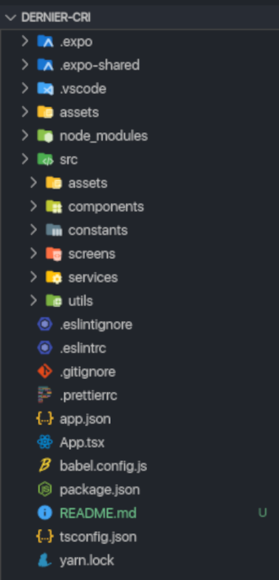

# Awesome
Made with heart by Adrien Guezennec.

## Consignes
Pour rappel voici les consignes donner pour ce test:
La base:
- Crée un dépôt sur ton propre Github
- Init en local un projet (via Expo)
- Utilise API News et choisis un flux au hasard https://newsapi.org ou https://unsplash.com/developers ou tout autre API disponible de ton choix

Développe 2 écrans :
- 1 écran de listing d'item
- 1 écran de détail pour chaque item
- Push tes modifications sur ton dépot Github

A fournir :
- Le Github avec les sources du projet
- Un Readme avec les explications sur ta méthodo de dev sur ce projet (par ex : comment installer le projet, détail de l'api, élément spécifique au projet ...)


## Introduction
Ne savant pas qu'un API ouverte était disponible pour utiliser le service Unsplash, j'ai décidé de choisir cette API pour faire le test. Etant un grand fan de Unsplash, j'étais très content de pouvoir utiliser leur API !

Une fois la documentation de l'API feuilleté, j'ai remarqué qu'il y avait un SDK pour javascript plutôt complet donc j'ai voulu l'utiliser avec un repo Expo neuf. Malheureusement, impossible d'utiliser le SDK JS... En regardant un peu plus les issues et la doc, le SDK est adapté pour le web ou serveur avec Node mais non pour mobile.
Du coup, j'ai wrappé l'API Unsplash dans un service afin de pouvoir effectuer des appels depuis une application React Native.

## Contenu
L'application présente 2 écrans, une gallerie avec les 30 dernières photos les plus récentes et un screen de détail listant quelques propriété de la photo ainsi que quelques chiffres concernant les statistiques de la photo.


## Architecture
Pour le projet, j'ai décidé d'utiliser une architecture que j'ai l'habitude d'effectuer dans mes projets React et React Native (avec quelques différence pour React).



- Dans les `assets`ont va retrouver les styles généraux à l'application ou des logos ainsi que des SVG. Actuellement il n'y a rien dedans car je n'ai pas utilisé de logo ni de SVG.
- `components` représente la lib de composants généric propre à l'application. Seul les composants avec un prefix **DC** devant le nom du dossier sont des composants propre à l'application.
- `constants`, c'est ici qu'on retrouve toutes les constantes de l'application (ex: couleur, crédential API, spacing, types, ....
- `screens` sont tous les écrans. Avec une arborescence propre à leur stack de navigation.
- `services`, c'est dans ce dossier qu'on retrouve le store avec tous les modèles ainsi que le service Unsplash. On peut imaginer utiliser plusieurs services dans une application bien plus développé.
- Et pour finir, `utils` est le dossier comprenant des fonctions utiles génériques que l'ont peut utiliser dans n'importe quel autre projet.


## Spécifications
Pour le développement j'ai utilisé Typescript avec Airbnb en config pour le linter.
- Store global: [Rematch](https://rematch.netlify.app/#/), wrapper the redux afin de simplifier son l'utilisation. Je n'utilise que ça depuis que je l'ai découvert.
- Navigation: [React Navigation](https://reactnavigation.org/), pour gérer la navigation de l'application.

## Installation
Une fois le repo cloné, aller dans le dossier du projet puis faite:
```sh
yarn
```
Si vous utilisez `npm` faite:
```sh
npm install
```

Aucune configuration supplémentaire n'est recquise.


Pour lancer le projet vous devez avoir [Expo](https://expo.io/) installé sur votre téléphone. Si vous souhaitez le lancer sur un émulateur suivez les instructions d'expo une fois le projet lancé.

```sh
yarn start
```

## Renseignements
Adrien Guezennec
adrien.guezennec@gmail.com
06.63.68.95.24


Enjoy :).